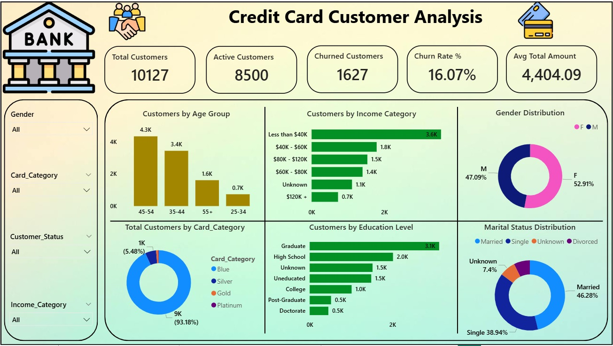
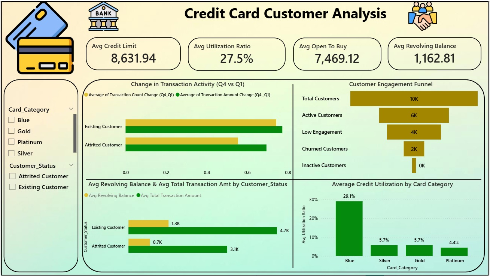
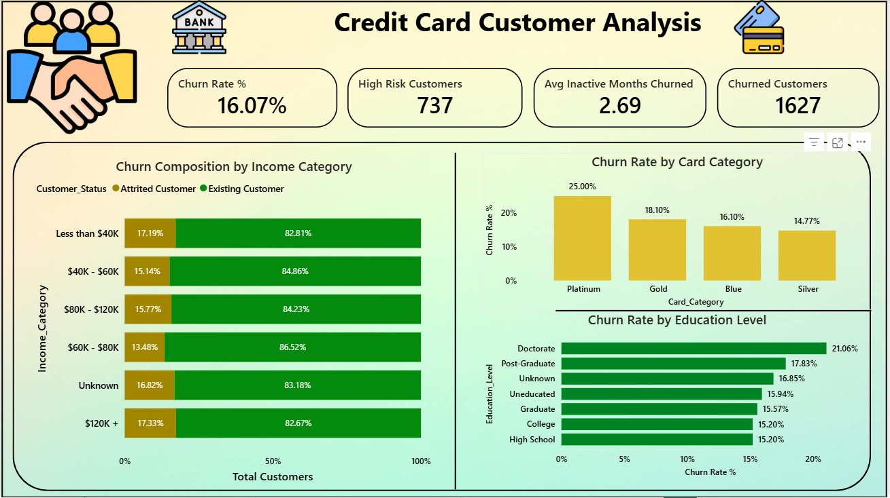

# Credit Card Customer Analysis 📊

## Project Overview
This project focuses on performing an end-to-end analysis of credit card customer data to understand customer behavior, spending patterns, transaction activity, and churn indicators. The goal of this analysis is to generate actionable insights that can help financial institutions improve customer retention, identify high-value customers, and optimize business strategies.

The project covers the complete data analytics lifecycle including data cleaning, transformation, SQL-based analysis, and interactive dashboard creation using Power BI.

---

## Problem Statement
Credit card companies handle large volumes of customer and transaction data. Without proper analysis, it becomes difficult to:
- Identify customers who are likely to churn
- Understand changes in transaction behavior over time
- Segment customers based on usage and profitability
- Monitor key performance indicators (KPIs)

This project aims to solve these challenges by analyzing historical customer and transaction data and presenting insights in a clear, visual, and decision-friendly format.

---

## Objectives
- Analyze customer demographics and account details
- Compare transaction activity across different quarters
- Identify churn-prone and high-value customers
- Create a clean and structured dataset for reporting
- Develop an interactive Power BI dashboard for business insights

---

## Tools & Technologies
- **Excel** – Data cleaning, preprocessing, and basic modeling  
- **SQL** – Data querying, filtering, aggregation, and analysis  
- **Power BI** – Data visualization and dashboard creation  
- **GitHub** – Project version control and documentation  

---

## Dataset Description
The project uses a credit card customer dataset containing:
- Customer demographic information
- Account and credit limit details
- Transaction counts and transaction amounts
- Quarterly activity indicators
- Churn-related attributes

### Dataset Files
- `Raw Dataset.csv` – Original dataset before cleaning  
- `Cleaned_Dataset.csv` – Cleaned and transformed dataset used for analysis  

Data cleaning steps included:
- Handling missing and inconsistent values
- Standardizing column names
- Removing duplicate records
- Creating derived metrics for analysis

---

## Data Cleaning & Preparation
Data cleaning was performed primarily using Excel to ensure the dataset was ready for analysis. Key steps included:
- Removing null and duplicate records
- Formatting numerical and categorical fields
- Creating calculated columns for transaction trends
- Validating data consistency across customer records

The cleaned dataset was then used for SQL queries and Power BI visualization.

---

## SQL Analysis
SQL was used to extract insights from the cleaned dataset, including:
- Customer segmentation based on spending behavior
- Comparison of transaction activity (Q1 vs Q4)
- Identification of churned vs active customers
- Aggregation of key metrics such as average transaction value and total transactions

SQL queries used for analysis are available in:
- `Sql.sql`

---

## Power BI Dashboard
An interactive Power BI dashboard was developed to visualize key insights and trends. The dashboard enables stakeholders to:
- Monitor overall customer count and churn rate
- Analyze transaction behavior across different customer segments
- Compare quarterly transaction activity
- Identify high-risk and high-value customers

### Dashboard Features
- KPI cards for customer count, churn rate, and transaction volume
- Filters for customer segments and activity status
- Visual comparison of transaction metrics across quarters

---

## Dashboard Preview 📊

### Overall Performance Dashboard

### Transaction Analysis

### Customer Insights

---

## Key Insights
- A noticeable change in transaction activity was observed between Q1 and Q4
- Customers with lower transaction frequency showed higher churn tendency
- High-value customers contributed a significant portion of total transaction volume
- Certain customer segments required targeted retention strategies

---

## Business Impact
The insights from this analysis can help organizations:
- Proactively identify customers at risk of churn
- Improve retention strategies through data-driven decisions
- Focus marketing efforts on high-value customer segments
- Track performance metrics using a centralized dashboard

---

## Project Structure
